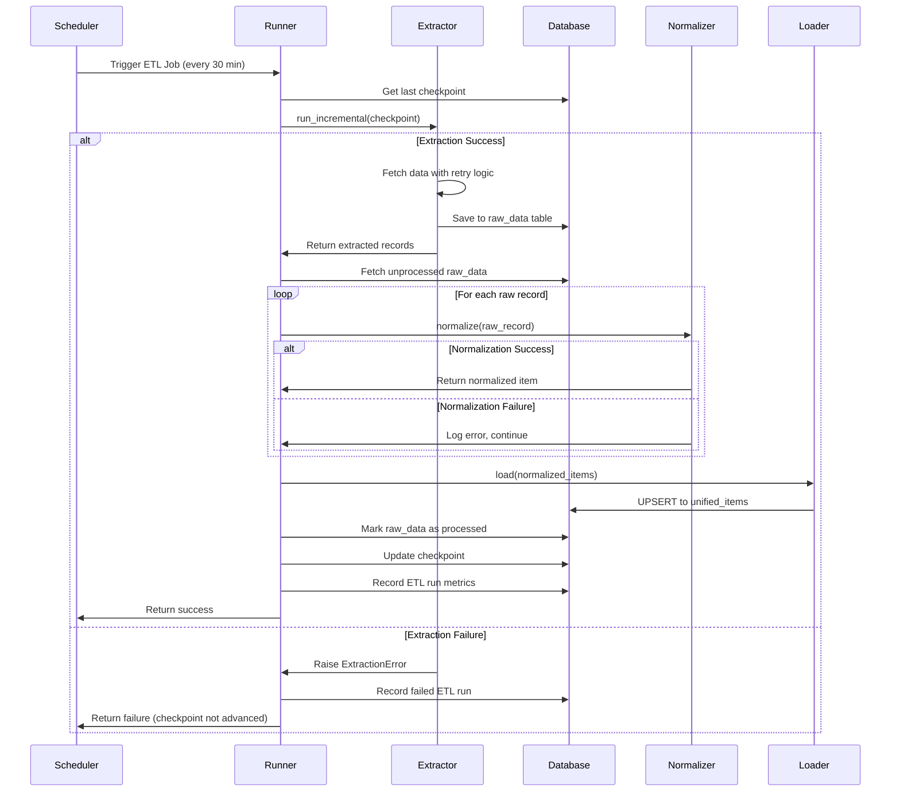
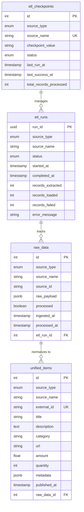
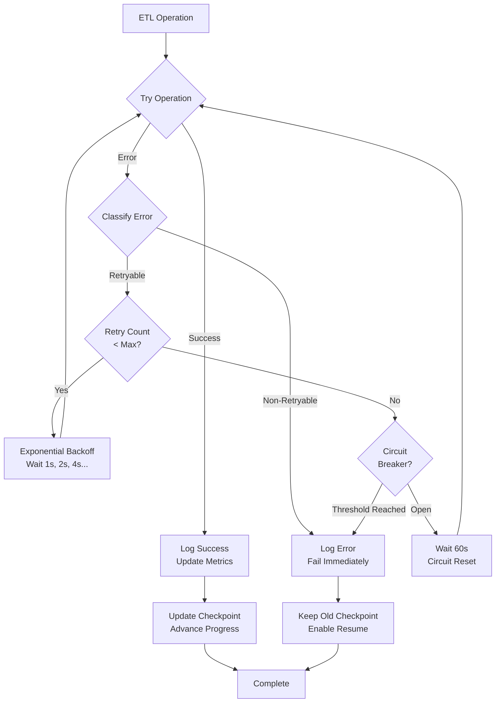
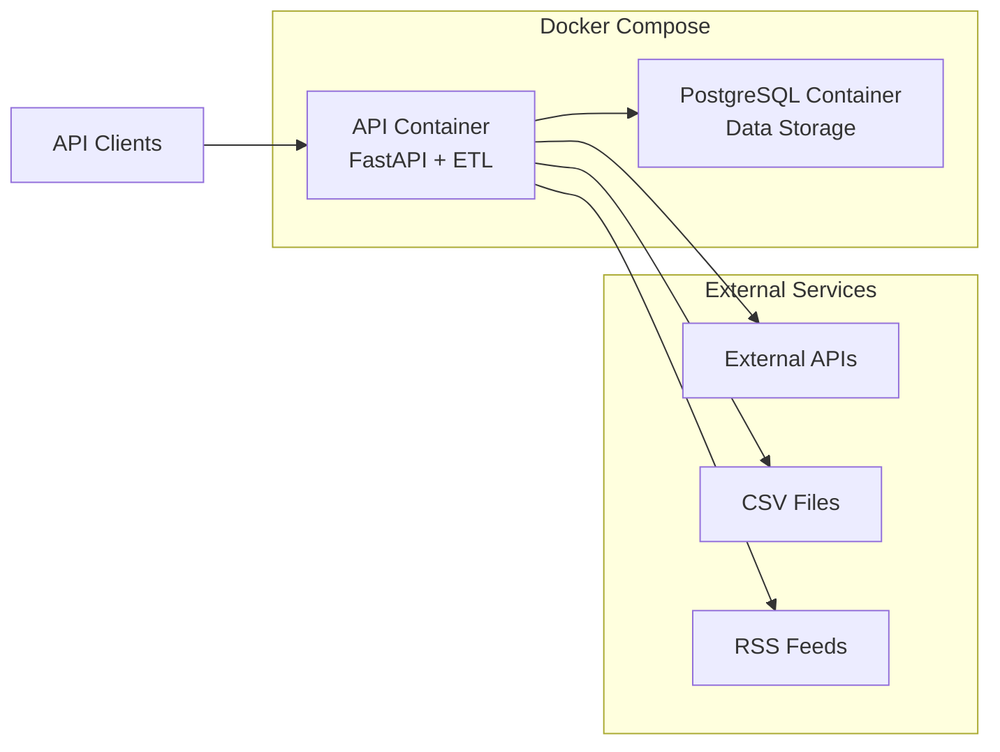

# Architecture Documentation

## System Overview

The Kasparro ETL system is a production-grade data pipeline designed to ingest, transform, and load data from multiple sources (APIs, CSV files, RSS feeds) into a unified PostgreSQL database with robust error handling and resume-on-failure capabilities.

## Design Principles

1. **Idempotency** - All operations can be safely re-run without creating duplicates
2. **Resilience** - Comprehensive error handling with retry logic and circuit breakers
3. **Observability** - Detailed logging and metrics tracking for every ETL run
4. **Scalability** - Batch processing and async operations for performance
5. **Maintainability** - Clear separation of concerns and comprehensive documentation

## System Architecture

```mermaid
graph TB
    subgraph "External Sources"
        API[REST APIs]
        CSV[CSV Files]
        RSS[RSS Feeds]
    end
    
    subgraph "ETL Pipeline"
        Scheduler[APScheduler<br/>30 min intervals]
        
        subgraph "Extract Phase"
            APIExt[API Extractor<br/>+Retry Logic<br/>+Circuit Breaker]
            CSVExt[CSV Extractor]
            RSSExt[RSS Extractor]
        end
        
        subgraph "Transform Phase"
            Normalizer[Data Normalizer<br/>+Schema Mapping<br/>+Validation]
        end
        
        subgraph "Load Phase"
            Loader[PostgreSQL Loader<br/>+Idempotent Upsert]
        end
        
        Runner[ETL Runner<br/>+Error Handling<br/>+Partial Failure Recovery]
    end
    
    subgraph "Storage Layer"
        DB[(PostgreSQL Database)]
        RawData[raw_data table]
        UnifiedItems[unified_items table]
        ETLRuns[etl_runs table]
        Checkpoints[etl_checkpoints table]
    end
    
    subgraph "API Layer"
        FastAPI[FastAPI Server]
        HealthEndpoint[/health]
        DataEndpoint[/data]
        StatsEndpoint[/stats]
    end
    
    API --> APIExt
    CSV --> CSVExt
    RSS --> RSSExt
    
    Scheduler --> Runner
    
    Runner --> APIExt
    Runner --> CSVExt
    Runner --> RSSExt
    
    APIExt --> RawData
    CSVExt --> RawData
    RSSExt --> RawData
    
    RawData --> Normalizer
    Normalizer --> Loader
    Loader --> UnifiedItems
    
    Runner --> ETLRuns
    Runner --> Checkpoints
    
    DB --> RawData
    DB --> UnifiedItems
    DB --> ETLRuns
    DB --> Checkpoints
    
    FastAPI --> HealthEndpoint
    FastAPI --> DataEndpoint
    FastAPI --> StatsEndpoint
    
    HealthEndpoint --> DB
    DataEndpoint --> UnifiedItems
    StatsEndpoint --> ETLRuns
```

## Data Flow



## Component Responsibilities

### 1. Extractors (`ingestion/extractors/`)

**Purpose**: Fetch data from external sources with resilience patterns

**Key Features**:
- **API Extractor**: 
  - Exponential backoff retry (3 attempts by default)
  - Circuit breaker pattern (opens after 5 failures, resets after 60s)
  - Rate limiting protection (respects HTTP 429 with Retry-After)
  - Timeout handling (30s default, configurable)
  - Pagination support
  
- **CSV Extractor**: 
  - File validation and encoding detection
  - Streaming for large files
  - Column mapping flexibility
  
- **RSS Extractor**: 
  - Feed parsing with feedparser
  - Entry deduplication

**Error Handling**:
- `APIExtractionError` - API-specific errors
- `NetworkError` - Retryable network issues
- `RateLimitError` - Rate limiting with retry-after
- `AuthenticationError` - Non-retryable auth failures

### 2. Transformers (`ingestion/transformers/`)

**Purpose**: Normalize data from different sources into unified schema

**Key Features**:
- Schema mapping per source type (API, CSV, RSS)
- Type conversion with safe parsing
- Field validation with Pydantic
- Default value handling
- Extra metadata preservation

**Error Handling**:
- `NormalizationError` - Field mapping failures
- `ValidationError` - Schema validation failures
- Partial failure support (logs error, continues processing)

### 3. Loaders (`ingestion/loaders/`)

**Purpose**: Load normalized data into PostgreSQL with idempotency

**Key Features**:
- Idempotent UPSERT using `INSERT ... ON CONFLICT DO UPDATE`
- Unique constraint: `(source_type, source_name, external_id)`
- Batch processing support (500 records per batch)
- Transaction safety

**Error Handling**:
- `DatabaseError` - Connection and query failures
- `UpsertError` - Constraint violations
- `DeadlockError` - Retryable deadlock detection

### 4. ETL Runner (`ingestion/runner.py`)

**Purpose**: Orchestrate the complete ETL pipeline

**Pipeline Phases**:
1. **Extract** - Fetch data from source
2. **Fetch** - Get unprocessed raw data (supports resume-on-failure)
3. **Transform** - Normalize to unified schema
4. **Load** - Upsert to database
5. **Mark Processed** - Update raw_data status
6. **Finalize** - Record metrics and update checkpoint

**Error Handling Strategy**:
- **Extraction Failure** → Fail fast, don't advance checkpoint
- **Normalization Failure** → Log error, continue with other records
- **Load Failure** → Rollback transaction, fail run
- **Partial Success** → Mark run as PARTIAL_SUCCESS, advance checkpoint

### 5. Scheduler (`ingestion/scheduler.py`)

**Purpose**: Automate ETL job execution

**Features**:
- APScheduler integration with FastAPI lifecycle
- Interval-based triggers (30 minutes default)
- Automatic startup on application launch
- Job replacement on restart

## Database Schema



## Error Handling Architecture



### Error Classification

**Retryable Errors** (will retry with exponential backoff):
- Network timeouts
- HTTP 429 (Rate Limiting)
- HTTP 5xx (Server Errors)
- Database connection failures
- Database deadlocks

**Non-Retryable Errors** (fail immediately):
- HTTP 401/403 (Authentication)
- HTTP 404 (Not Found)
- Schema validation errors
- Data format errors
- Constraint violations

## Checkpoint Management

Checkpoints enable **resume-on-failure** by tracking the last successfully processed position for each data source.

**Checkpoint Types**:
- `timestamp` - For time-based incremental loading (APIs, RSS)
- `id` - For ID-based incremental loading (databases)
- `page` - For pagination-based loading

**Checkpoint Advancement Rules**:
1. Checkpoint is ONLY advanced on successful extraction
2. If normalization/load fails, checkpoint stays at previous value
3. Next run will retry failed records (via `processed=False` flag)
4. Prevents data loss on partial failures

## API Layer

### Endpoints

- `GET /health` - System health check with database connectivity
- `GET /data` - Query unified data with filtering and pagination
- `GET /stats` - ETL run statistics and metrics
- `GET /docs` - Interactive Swagger documentation

### Response Format

All responses follow a consistent structure:
```json
{
  "status": "success",
  "data": { ... },
  "metadata": {
    "page": 1,
    "page_size": 10,
    "total": 100
  }
}
```

## Scalability Considerations

1. **Batch Processing** - Process records in batches (1000 raw records, 500 upserts)
2. **Async Operations** - All I/O operations use async/await
3. **Connection Pooling** - SQLAlchemy async engine with connection pool
4. **Pagination** - API responses paginated to prevent memory issues
5. **Incremental Loading** - Only fetch new data since last checkpoint

## Monitoring & Observability

### Logging Levels

- `DEBUG` - Detailed operation logs (request attempts, record counts)
- `INFO` - Normal operations (ETL start/complete, records processed)
- `WARNING` - Recoverable issues (retries, circuit breaker activation)
- `ERROR` - Operation failures (extraction errors, load failures)

### Metrics Tracked

- Records extracted per run
- Records loaded per run
- Records failed per run
- ETL run duration
- Success rate per source
- Last successful run timestamp

### Error Context

All custom exceptions include structured context:
```python
{
  "error_type": "APIExtractionError",
  "message": "Rate limit exceeded",
  "context": {
    "source_name": "coingecko_markets",
    "api_url": "https://api.example.com",
    "status_code": 429,
    "retry_count": 3
  },
  "timestamp": "2025-12-23T11:50:00Z"
}
```

## Deployment Architecture



### Container Responsibilities

**API Container**:
- FastAPI web server (port 8000)
- APScheduler for automated ETL
- ETL pipeline components
- Python dependencies

**PostgreSQL Container**:
- Database server (port 5432)
- Data persistence via Docker volumes
- JSONB extension for flexible storage

## Security Considerations

1. **API Keys** - Stored in environment variables, never committed
2. **Database Credentials** - Managed via `.env` file
3. **SQL Injection** - Prevented by SQLAlchemy ORM
4. **Input Validation** - Pydantic schemas validate all data
5. **Error Messages** - Sensitive data truncated in logs

## Future Enhancements

1. **Authentication** - Add API key authentication for endpoints
2. **Alerting** - Email/Slack notifications on ETL failures
3. **Metrics Dashboard** - Grafana/Prometheus integration
4. **Data Quality** - Add data quality checks and validation rules
5. **Horizontal Scaling** - Distribute ETL jobs across multiple workers
6. **Stream Processing** - Real-time data ingestion with Kafka/RabbitMQ
